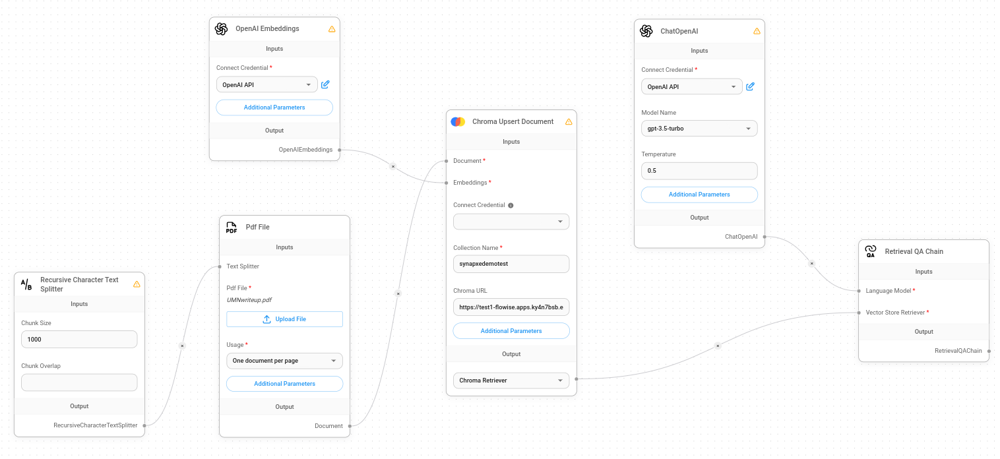

# RAG Document Summariser Demo

### Provisioning ARO

01. Provision an 'Azure with ARO Open Environment (Subscription Based)' ([ARO](https://demo.redhat.com/catalog?search=aro&item=babylon-catalog-prod%2Fazure-gpte.open-environment-aro4-sub.prod)) on 'demo.redhat.com'

### Developing HTML Frontend

faruq to add

### Deploying Services

02. Deploy services on ARO by deploying the following images:
    * ChromaDB server: docker.io/faruqzafir/test1:v1
    * HTML frontend: docker.io/rach228/flowise-webserver:v3
        * Ensure container is exposed at port 8080
    * Flowise chatflow: docker.io/rach228/flowise-chatflow:1.2

### Building Chatflow on Flowise

03. Open Flowise from the service running on ARO

04. Build a chatflow based on the sample above